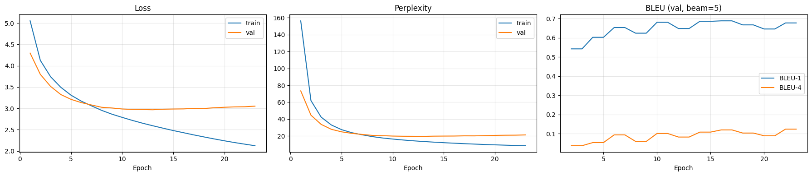
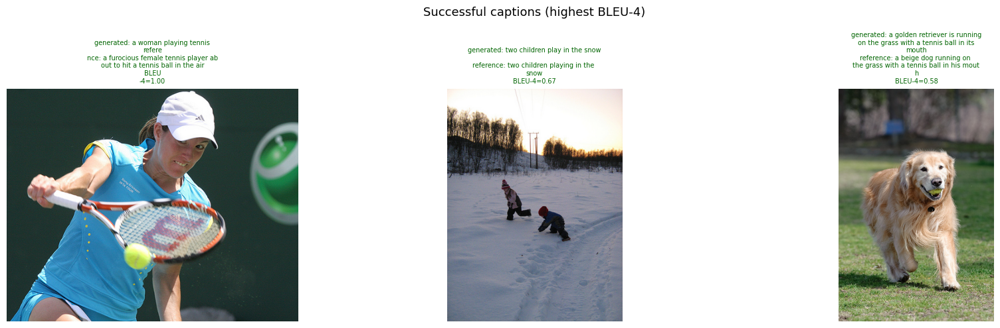
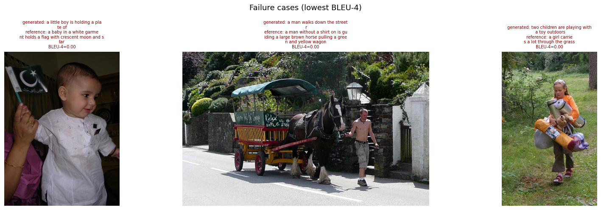

# The Visual Storyteller
  A deep learning system that generates natural language descriptions of images using encoder-decoder architecture. A pretrained EfficientNet-B4 model acts as the visual encoder, extracting high-level spatial features from each input image. These features are projected into 512-dimensional visual tokens and passed to a two-layer Transformer decoder, which uses masked self-attention to model previously generated words and cross-attention to focus on relevant image regions. During inference, captions are generated word by word using beam search.
 
  The model is sized for ~8,091 images × 5 captions ≈ 40k caption/image pairs. Data is split into train / validation / test, with the test split held out and untouched during training — it is only ever used for final inference/evaluation, so the reported test score reflects genuine generalization rather than tuning against it.
 
---
## Data
- ~8,091 images, 5 human-written captions per image.
- Captions are lowercased and stripped of punctuation before tokenizing.
- Splitting is done by image, not by caption, so all 5 captions of a given image stay in the same split — this avoids leaking near-duplicate captions across
train/val/test.
- Vocabulary is built only from the training captions; words appearing fewer than MIN_FREQ (4) times are mapped to <unk>. Special tokens: <pad> <unk> <sos> <eos>.

 ### Dataset Split
 | Subset | Images |
|---|---:|
| Training | 7,182 |
| Validation | 809 |
| Test | 100 |
---
## Architecture
  The system follows an encoder-decoder design where the encoder reads the image and the decoder generates the caption word by word.
The data pipeline can be visualized in the following manner: 
```
Image (380×380)
    ↓
EfficientNet-B4 encoder
(pretrained on ImageNet, blocks 6–8 fine-tuned)
    ↓
144 spatial feature vectors × 512 dimensions
    ↓
2-layer Transformer decoder
(self-attention + cross-attention + weight tying)
    ↓
Beam search (width=5, length penalty=0.7)
    ↓
Generated caption
```
### Encoder — EfficientNet-B4
- Pretrained on ImageNet 
- Blocks 0–5 frozen to preserve universal low-level features
- Blocks 6–8 fine-tuned to adapt semantic features for captioning
- 1×1 convolution projects 1792 → 512 channels
- Output: `(batch, 144, 512)` — 144 spatial tokens per image
 
### Decoder — 2-layer Transformer
- Token embedding with Xavier initialisation
- Sinusoidal positional encoding
- 2 × TransformerDecoderLayer (self-attention + cross-attention + feedforward network)
- 8 attention heads
- Weight tying between embedding matrix and output projection
- Beam search with length penalty at inference


### Optimization and Training

The model is trained and optimized using:
- AdamW optimizer - updates the model parameters while applying weight decay to reduce overfitting
- Mixed-precision training - uses lower-precision GPU operations where safe, reducing memory usage and speeding up training.
- Gradient clipping
- Label smoothing - uses a smoothing value of 0.05 to reduce overconfident next-word predictions and improve generalization.
- Learning-rate warmup and cosine decay - gradually increases the learning rate during the first seven epochs, then reduces it smoothly for more stable late-stage training.
- Image augmentation - applies random cropping, flipping, rotation, colour variation, grayscale conversion and random erasing to reduce memorization of the training images.
- Early stopping - stops training when validation performance no longer improves for ten consecutive checks, preventing unnecessary training and overfitting.
- Separate learning rates for the pretrained encoder and new decoder - uses 8e-5 for the pretrained EfficientNet encoder and 3e-4 for the newly initialized Transformer decoder. The encoder changes more conservatively, while the decoder learns the captioning task faster.

| Hyperparameter | Value |
|---|---:|
| Batch size | 64 |
| Encoder learning rate | `8e-5` |
| Decoder learning rate | `3e-4` |
| Encoder dropout | 0.15 |
| Decoder dropout | 0.30 |
| Label smoothing | 0.05 |
| Weight decay | 0.03 |
| Maximum epochs | 30 |

 
### Key Design Decisions
| Decision | Rationale |
|---|---|
| EfficientNet-B4 over ResNet-50 | +7% ImageNet accuracy, fewer parameters, richer features |
| Transformer over LSTM | Direct cross-attention to all image regions, no hidden-state bottleneck |
| Single-scale features | Multi-scale doubles sequence length with marginal gain on 8k images |
| Blocks 6–8 fine-tuned only | Prevents overfitting on small dataset, preserves ImageNet low-level features |
| Weight tying | Reduces parameters, improves generalisation on small datasets |
| Beam search over greedy | Avoids locally optimal but globally poor caption choices |
 
---
## Results
### Evaluation Metrics
#### Cross-Entropy Loss
Cross-entropy loss is computed using teacher forcing, where the decoder receives the correct previous words and predicts the next token. Padding positions are ignored during the calculation. Lower loss indicates that the model assigns higher probability to the correct next words.

#### Perplexity (Teacher-Forced)
Perplexity is calculated from the cross-entropy loss:
`Perplexity = exp(loss)`
It measures how uncertain the model is when predicting the next word given the correct previous context. Lower perplexity indicates stronger language-modeling performance.

#### BLEU (Generation score)
- BLEU-1: measures how many individual words in the generated caption also appear in the human-written reference captions. A higher BLEU-1 score means the model selected more relevant words for the image.
- BLEU-4: measures overlap between sequences of up to four consecutive words, so it reflects phrase structure and fluency more strongly than BLEU-1. A higher BLEU-4 score means the generated caption more closely matches the wording and structure of the reference captions.

The following are the final metric results the model produced: 

| Metric | Value |
|---|---:|
| Best validation loss | 2.9679 |
| Best validation 1-gram precision | 0.688 |
| Best validation 4-gram precision | 0.124 |
| Test 4-gram precision | 0.094 |
| Epochs completed | 23 |


### Training Curves

  

   The model's validation loss reached its minimum before the generation score reached its maximum. For this reason, separate checkpoints are saved for the best validation loss and the best caption-generation score.

### Successful Outputs
 
 
  The model performs well on scenes containing people, dogs, sports and outdoor activities.
  
---
## Failure Analysis

   

   The observed failures mainly involve omitted secondary objects, incorrect object counts, confusion between visually similar objects and generic descriptions. The model usually identifies the dominant subject and general scene correctly, but it can lose small visual details. 
